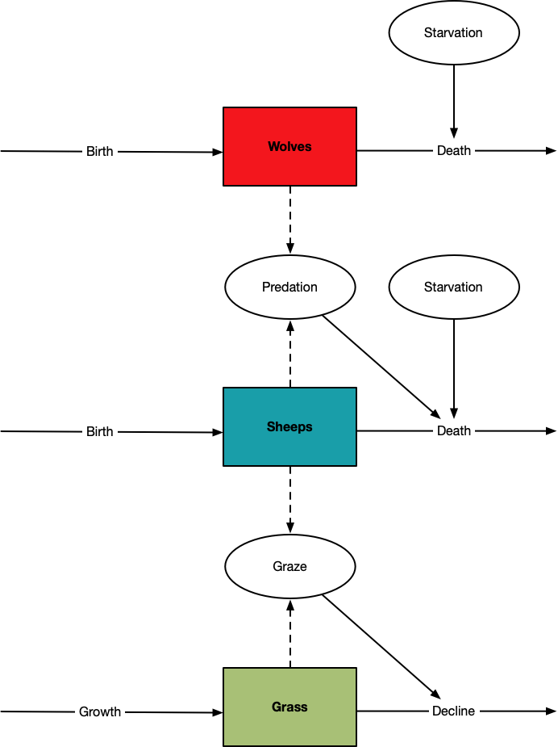
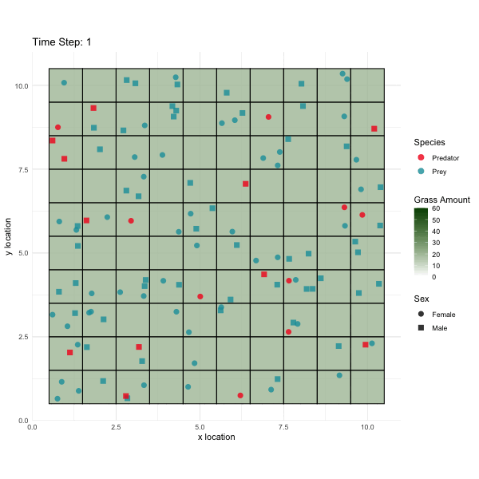
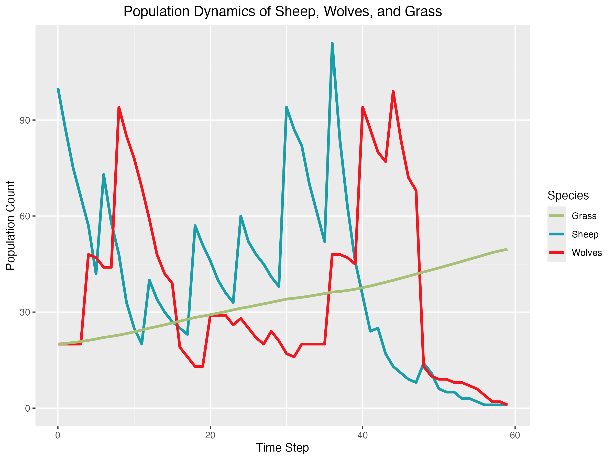

```{r setup, include=FALSE}
knitr::opts_chunk$set(echo = FALSE, message = FALSE, warning = FALSE, 
                      fig.align='center')
```

# Motivation

For a very long time, the preservation of biological and ecological systems has been a major priority. To develop practical solutions, it is crucial to first understand natural relationships, particularly the dynamic interaction between predators and their prey. This interaction is a central theme in both ecology and mathematical ecology due to its universal significance and importance @berryman1992orgins. These issues are more complex than they initially appear. Predators have an enormous impact on predator-prey dynamics. Predation can have a major impact on prey populations and their habitats, which may result in the extinction of prey species and the subsequent extinction of predators @chakraborty2019complexity. Conversely, in an ecosystem where predators are entirely removed, prey populations can become overpopulated, resulting in food shortages for them. Therefore, it is essential to maintain a balance in these interactions to ensure ecosystem stability. The initial differential equations that describe the interactions between prey and predators were separately developed by @lotka1925elements and @volterra1927variazioni, and are commonly referred to as the Lotka-Volterra prey-predator model. Progress in this field has been driven by effective collaboration between mathematicians and ecologists.

Building on this idea, my project aims to model the complex interactions among prey, predators, and their environment (grass field). The objective is to enhance our understanding of ecological principles through interactive simulation. By investigating the impacts of individual behaviors on ecosystem stability and biodiversity, we aim to uncover valuable insights into the dynamics of natural systems.

For instance, consider the wolf (Canis lupus), the most widespread large carnivore in Europe. Wolves were progressively eliminated throughout Western Europe in the 18th and 19th centuries. However, due to improved conservation efforts, the European wolf population has recovered @randi2011genetics. The presence of wolves can lead to increased conflicts with humans, particularly due to competition over livestock.

# Describe of the model

Now, delving into the model description, it comprises three key variables: wolves, sheep, and grass. Within this simulation, wolves consume sheep, while sheep graze on grass. The system dynamics are influenced by birth and death processes, along with movement (Figure 1). Each of these processes operates once per time unit.

Moving to the grass component, it is represented as a grid with *n* columns and *n* rows. Initially, each grid cell contains the same amount of grass units. During each time step, the grass grows at a specified rate. Sheep graze on the grass at a predetermined rate per sheep. To maintain ecological balance, a maximum threshold is set for grass amount on each grid. If the grass amount exceeds this threshold, further growth is inhibited. Transitioning to the sheep aspect, these animals typically remain stationary unless they encounter an area devoid of grass. Reproduction occurs when at least one female and one male are within a certain proximity after a specified interval of time. The number of offspring is randomly determined within a specified range. Sheep face mortality from two primary causes: predation by wolves, and failure to find grass after a specified number of movements. One wolf consume only one sheep per time step. Lastly, addressing the wolf variable, these creatures move randomly, either to an adjacent location or by remaining in place. However, they must relocate if the current location has no remaining sheep. Similar to sheep, wolves engage in reproduction under the same conditions, albeit with a different interval. Wolves die if they cannot locate prey after a certain number of movements. This structured model serves as a comprehensive framework for simulating and analyzing the interactions within the ecosystem.

<center>

{width="500"}

</center>

# Code

```{r echo=TRUE, eval=FALSE}
library(animation)
library(plotrix)
library(ggplot2)
library(tidyverse)

# Simulate individual birth -----
## Individuals only give birth after a specified amount of time (time_interval).
## Reproduction requires the presence of both male and female individuals within a certain proximity (reproduction_radius) 
## around a female individual's location.
## The repr column in the individual's dataset (prey) keeps track of the number of offspring produced by each female individual.
## Number of offspring randomly selects from 0 to max_new_individuals

birth<-function(inds, time, reproduction_radius, max_new_individuals, grid_size, time_interval=10){
  ind_cols <- ncol(inds)
  
  if (time %% time_interval != 0) {
    # If current time is not a multiple of the specified interval, return original population
    return(inds)
  }
  
  for (i in 1:nrow(inds)) {
    if (inds[i,"sex"] == 1){ # Check if the individual is female
      # Extract current individual's location
      current_xloc <- inds[i, "xloc"]
      current_yloc <- inds[i, "yloc"]
      
      # Define area boundaries for neighboring individuals
      x_min <- max(0, current_xloc - reproduction_radius)  # Ensure x_min does not go below 1
      x_max <- min(grid_size, current_xloc + reproduction_radius)  # Ensure x_max does not exceed 10
      y_min <- max(0, current_yloc - reproduction_radius)  # Ensure y_min does not go below 1
      y_max <- min(grid_size, current_yloc + reproduction_radius)  # Ensure y_max does not exceed 10
      

      # Subset males within the same area
      males_neighbors <- inds[inds[,"sex"] == 0 & inds[,"xloc"] >= x_min & inds[,"xloc"] <= x_max &
                          inds[,"yloc"] >= y_min & inds[,"yloc"] <= y_max, ]
      
      if (nrow(males_neighbors) > 0) {
        # Determine the number of new individuals to generate (between 0 and max_new_individuals)
        num_new_individuals <- sample(1:max_new_individuals, size = 1)
        
        # Update the reproduction count for the current female individual
        inds[i, "repr"] <- num_new_individuals
        
        # Generate new individuals and form mating pairs
        new_inds <- data.frame(matrix(0, nrow = num_new_individuals, ncol = ind_cols))
        colnames(new_inds) <- colnames(inds)
        new_inds$sex <- sample(c(1, 0), size = num_new_individuals, replace = TRUE)  # Randomly assign sex
        # Generate valid xloc and yloc for new individuals within the grid boundaries
        new_xloc <- current_xloc + sample(c(-1, 0, 1), size = num_new_individuals, replace = TRUE)
        new_yloc <- current_yloc + sample(c(-1, 0, 1), size = num_new_individuals, replace = TRUE)
        
        # Ensure new_xloc and new_yloc fall within grid boundaries
        new_xloc <- pmin(pmax(new_xloc, 1), grid_size)
        new_yloc <- pmin(pmax(new_yloc, 1), grid_size)
        
        new_inds$xloc <- new_xloc
        new_inds$yloc <- new_yloc
        
        # Append new individuals to the population
        inds <- rbind(inds, new_inds)
      }
    }
  }
  return(inds)
}

# Simulate grass -----

simulate_grass <- function(grass_data, sheep_data, growth_rate, grazing_rate, max_grass_amount) {
  # Update grass amount for each grid cell based on growth rate
  grass_data[,"amount"] <- pmin(grass_data[,"amount"] + growth_rate, max_grass_amount)  # Ensure grass does not exceed max amount
  
  # Iterate over each grid cell to check for sheep grazing
  for (i in 1:nrow(grass_data)) {
    x <- grass_data[i, "xloc"]
    y <- grass_data[i, "yloc"]
    
    # Check if there are sheep at the current grid cell
    sheep_at_cell <- which(sheep_data[, "xloc"] == x & sheep_data[, "yloc"] == y)
    
    if (length(sheep_at_cell) > 0) {
      # Calculate total grass eaten by sheep at this grid cell
      grass_eaten <- length(sheep_at_cell) * grazing_rate
      
      # Reduce grass amount by the total amount eaten by sheep
      grass_data[i, "amount"] <- max(0, grass_data[i, "amount"] - grass_eaten)
    }
  }
  
  return(grass_data)
}

# Simulate individual movement -----

## Sheep's movement: Normally sheeps don't move. They only move if they encounter an area without grass (amount == 0).
## The sheep's movement (movement column) is incremented by 1 for each successful move. 
## And reset sheep's movement to zero if new location has grass

movement_prey <- function(prey, grass, grid_size){
  move_dists   <- c(-1, 0, 1)  # Define the possible distances to move
  for (i in 1:nrow(prey)){
    # Check if the sheep runs out of grass 
    current_xloc <- prey[i,"xloc"]
    current_yloc <- prey[i,"yloc"]
    
    matching_rows <- which(grass[,"xloc"] == current_xloc & grass[,"yloc"] == current_yloc)
    grass_amount <- grass[matching_rows[1], "amount"]
    
    if (length(matching_rows) > 0 & grass_amount == 0) {
      # Generate all possible movement directions (including diagonals)
      possible_moves <- expand.grid(x = move_dists, y = move_dists)
      # Remove (0,0) because sheep must move if there is no grass in this grid
      possible_moves <- possible_moves[!(possible_moves$x == 0 & possible_moves$y == 0), ]
      # Shuffle the possible moves to randomize direction
      possible_moves <- possible_moves[sample(nrow(possible_moves)), ]
      # Try each possible move until a valid new location is found
      found_valid_move <- FALSE
      
      for (j in 1:nrow(possible_moves)) {
        new_xloc <- current_xloc + possible_moves[j, "x"]
        new_yloc <- current_yloc + possible_moves[j, "y"]
        
        # Check if new location is within grid boundaries
        if (new_xloc >= 1 && new_xloc <= grid_size && new_yloc >= 1 && new_yloc <= grid_size) {
          found_valid_move <- TRUE
          
          # Update prey's location to the new valid location
          prey[i, "xloc"] <- new_xloc
          prey[i, "yloc"] <- new_yloc
          
          # Increment the 'movement' column if no grass is found in the new location
          if (grass[which(grass[, "xloc"] == new_xloc & grass[, "yloc"] == new_yloc), "amount"] == 0) {
            prey[i, "movement"] <- prey[i, "movement"] + 1
          } else {
            # Reset movement count if there is grass
            prey[i, "movement"] <- 0
          }
          
          break  # Stop searching once a valid move is found
        }
      }
      
      # If no valid move is found, prey stays at the current location
      if (!found_valid_move) {
        prey[i, "movement"] <- prey[i, "movement"] + 1  # Increment movement count
        # No need to update xloc and yloc because prey stays in place
      }
    }
  }
  
  return(prey)
}
## Function to check if there are individuals at a specific location
inds_at_location <- function(x, y, inds) {
  return(sum(inds[,"xloc"] == x & inds[,"yloc"] == y) > 0)
}

## Predator's movement: Wolves move randomly. They may choose to move to an adjacent location or stay in place. 
## However, wolves must move to a new location if the current location has no remaining sheep.
## The wolf's movement (movement column) is continuously incremented by 1 for each successful move if the new location doesn't contain any sheeps (prey). 
## If a wolf encounters a sheep during its movement, its movement count resets to zero.

movement_pred <- function(pred, prey, grid_size){
  move_dists   <- c(-1, 0, 1) 
  for (i in 1:nrow(pred)){
    current_xloc <- pred[i,"xloc"]
    current_yloc <- pred[i,"yloc"]
    # Generate all possible movement directions (including diagonals)
    possible_moves <- expand.grid(x = move_dists, y = move_dists)
    # Shuffle the possible moves to randomize direction
    possible_moves <- possible_moves[sample(nrow(possible_moves)), ]
    # Try each possible move until a valid new location is found
    found_valid_move <- FALSE
    if (!inds_at_location(current_xloc, current_yloc, prey)){
      # Remove (0,0) because wolves must move if there is no sheep in this grid
      possible_moves <- possible_moves[!(possible_moves$x == 0 & possible_moves$y == 0), ]
    }
    
    for (j in 1:nrow(possible_moves)) {
      new_xloc <- current_xloc + possible_moves[j, "x"]
      new_yloc <- current_yloc + possible_moves[j, "y"]
      
      # Check if new location is within grid boundaries
      if (new_xloc >= 1 && new_xloc <= grid_size && new_yloc >= 1 && new_yloc <= grid_size) {
        found_valid_move <- TRUE
        break  # Stop searching once a valid move is found
      }
    }
    
    # Update predator's location if a valid move was found
    if (found_valid_move) {
      pred[i, "xloc"] <- new_xloc
      pred[i, "yloc"] <- new_yloc
    }
    
    # Increment the 'movement' column by 1 if there is no sheep in the new location
    if (!inds_at_location(new_xloc, new_yloc, prey)){
      pred[i, "movement"] <- pred[i, "movement"] + 1
    } else {
      # Reset movement count if the predator encounters prey (sheep)
      pred[i, "movement"] <- 0
    }
  }
  return(pred)
}

# Simulate individual death (because of starvation) ------

death <- function(inds, movement_max) {
  # Mark individuals as dead (death = 1) if movement count exceeds the threshold
  inds[,"death"] <- ifelse(inds[, "movement"] >= movement_max, 1, 0)
  # Filter and return only individuals who are still alive (death == 0)
  inds_alive <- inds[inds[,"death"] == 0, ]
  return(inds_alive)
}

# Simulate predator-prey dynamics-----
## Each wolf can eat maximum one sheep for each time run
## Predation happens only when predator and prey are in the same grid.
predation <- function(prey, pred){
  predators   <- nrow(pred)
  for(p in 1:predators){       # For each predator (p) in the array
    current_xloc <- pred[p,"xloc"]
    current_yloc <- pred[p,"yloc"]
    N_prey <- sum(prey[, "xloc"] == current_xloc & prey[, "yloc"] == current_yloc)
    if(N_prey > 0){ # If there are some alive prey, find them
      prey_ind <- which(prey[, "xloc"] == current_xloc & prey[, "yloc"] == current_yloc )
      if(N_prey >= 2){ # But if there are more than 2, just eat 2
        prey_ind <- sample(x = prey_ind, size = 1, replace = TRUE);
      }
      prey[prey_ind, "death"] <- 1; # Record the prey as dead
    }
  }
  return(prey)
}

# Plotting function -----
# Plotting function
plotSimulation <- function(simulation_history, gridSize, filename = "simulation_movie.gif", fps = 10) {
  nframes <- length(simulation_history)
  
  # Calculate fps as a valid factor of 100
  valid_fps <- 100 / round(100 / fps)
  
  saveGIF({
    for (t in seq_along(simulation_history)) {
      prey <- simulation_history[[t]]$preys
      pred <- simulation_history[[t]]$predators
      grass <- simulation_history[[t]]$grass
      
      # Create data frames for plotting using ggplot2
      df_grass <- data.frame(grass)
      df_prey <- prey %>%
        as.data.frame() %>%
        mutate(Species = "Prey")
      df_pred <- pred %>%
        as.data.frame() %>%
        mutate(Species = "Predator")
      
      df_inds <- rbind(df_prey, df_pred) %>%
        mutate(sex = ifelse(sex == 1, "Female", "Male"))
      
      
      # Plot grass patches using ggplot2
      p <- ggplot(data = df_grass, aes(x = xloc, y = yloc)) +
        geom_rect(aes(xmin = xloc - 0.5, xmax = xloc + 0.5, ymin = yloc - 0.5, ymax = yloc + 0.5, fill = amount),
                  color = "black", alpha = 0.8) +
        scale_fill_gradient(low = "white", high = "#004d00", name = "Grass Amount", limits=c(0, 60)) +
        theme_minimal() +
        theme(legend.position = "none") +
        coord_equal()  # Ensure aspect ratio is equal
      
      # Plotting using ggplot2
      p <- p + geom_jitter(data = df_inds, aes(x = xloc, y = yloc, shape = sex, color = Species), size = 3, alpha = 0.8) +
        scale_shape_manual(values = c(16, 15)) +  # Shape values for female and male
        scale_color_manual(values = c("Prey" = "#189EA9", "Predator" = "#F3161E")) +
        labs(x = "x location", y = "y location", title = paste0("Time Step: ", t)) +
        theme_minimal() +
        guides(shape = guide_legend(title = "Sex"), color = guide_legend(title = "Species"))
      
      print(p)  # Print the plot
      
    }
  }, interval = 1 / valid_fps, movie.name = filename, ani.width = 600, ani.height = 600)
}

plotPopulationDynamics <- function(simulation_history) {
  # Extract population counts from simulation history
  sheep_counts <- sapply(simulation_history, function(sim) nrow(sim$preys))
  wolf_counts <- sapply(simulation_history, function(sim) nrow(sim$predators))
  grass_counts <- sapply(simulation_history, function(sim) mean(sim$grass$amount))  # Sum of grass amount
  
  time_steps <- seq_along(simulation_history) - 1  # Adjust time steps for plotting
  
  # Create a data frame for plotting
  plot_data <- data.frame(TimeStep = time_steps, Sheep = sheep_counts, Wolves = wolf_counts, Grass = grass_counts)
  
  # Plot population dynamics using ggplot2
  ggplot(plot_data, aes(x = TimeStep)) +
    geom_line(aes(y = Sheep, color = "Sheep", linetype = "Sheep"), size = 1.2) +
    geom_line(aes(y = Wolves, color = "Wolves", linetype = "Wolves"), size = 1.2) +
    geom_line(aes(y = Grass, color = "Grass", linetype = "Grass"), size = 1.2) +  # Add grass line
    labs(x = "Time Step", y = "Population Count", title = "Population Dynamics of Sheep, Wolves, and Grass") +
    theme(plot.title = element_text(hjust = 0.5)) +
    scale_linetype_manual(name = "Species", values = c("Sheep" = "solid", "Wolves" = "solid", "Grass" = "solid")) +
    scale_color_manual(name = "Species", values = c("Sheep" = "#189EA9", "Wolves" = "#F3161E", "Grass" = "#A8BF76")) +
    guides(color = guide_legend(title = "Species", override.aes = list(linetype = c("solid", "solid", "solid"))),
           linetype = guide_legend(title = "Species")) +
    scale_y_continuous(limits = c(0, max(max(sheep_counts), max(wolf_counts), max(grass_counts))))  # Adjust y-axis limits
}


# Putting it all together ------

{
  # Parameters
  parameters <- list(
    gridSize = 10,
    numSheep = 100,
    numWolves = 20,
    grassInitial = 20,
    growthRate = 0.7,
    grazingRate = 0.5,
    reproRadius = 2,
    reproNum = 5,
    maxGrass = 60, 
    movementThreshold = 4,
    prey_time_interval = 6,
    pred_time_interval = 4,
    tmax = 60  # Number of time steps to simulate
  )
  
  # Initialize prey (individuals) array
  prey <- data.frame(
    sex = sample(c(1, 0), size = parameters$numSheep, replace = TRUE),
    xloc = sample(1:parameters$gridSize, size = parameters$numSheep, replace = TRUE),
    yloc = sample(1:parameters$gridSize, size = parameters$numSheep, replace = TRUE),
    repr = 0,  # Initial reproduction count
    death = 0,  # Initial death status
    movement = 0  # Initial movement count
  )
  
  # Initialize predator (individuals) array
  pred <- data.frame(
    sex = sample(c(1, 0), size = parameters$numWolves, replace = TRUE),
    xloc = sample(1:parameters$gridSize, size = parameters$numWolves, replace = TRUE),
    yloc = sample(1:parameters$gridSize, size = parameters$numWolves, replace = TRUE),
    repr = 0,  # Initial reproduction count
    death = 0,  # Initial death status
    movement = 0  # Initial movement count
  )
  
  # Initialize grid (grass) array
  grass <- data.frame(
    xloc = rep(1:parameters$gridSize, each = parameters$gridSize),
    yloc = rep(1:parameters$gridSize, times = parameters$gridSize),
    amount = parameters$grassInitial  # Initial amount of grass in each grid cell
  )
  
  # Run simulation -----
  simulation_history <- list()
  
  simulation_history[[1]] <- list(preys = prey, predators = pred, grass = grass)
  
  for (t in 1:parameters$tmax) {
    print(paste("Time Step:", t))
    
    # Check for edge cases
    current_num_sheep <- nrow(prey)
    current_num_predators <- nrow(pred)
    current_grass_amount <- sum(grass$amount)
    
    if (current_num_sheep == 0 || current_num_predators == 0) {
      print("Population Extinction")
      break
    }
    
    if (current_grass_amount == 0) {
      print("Ecosystem Collapse")
      break
    }
    
    # Update grass growth and consumption 
    grass <- simulate_grass(grass, prey, growth_rate = parameters$growthRate, 
                            grazing_rate = parameters$grazingRate, 
                            max_grass_amount = parameters$maxGrass)
    
    # Movement of individuals
    prey <- movement_prey(prey, grass, grid_size = parameters$gridSize)
    pred <- movement_pred(pred, prey, grid_size = parameters$gridSize)
    
    # Death (based on movement threshold)
    prey <- death(prey, movement_max = parameters$movementThreshold)
    pred <- death(pred, movement_max = parameters$movementThreshold)
    
    # Check if there are still living predators and preys
    if (nrow(pred) == 0 || nrow(prey) == 0) {
      print("Population Extinction")
      break
    }
    
    # Predation (interaction between predators and prey)
    prey <- predation(prey, pred)
    
    # Remove dead entities
    prey <- prey[prey[,"death"] == 0,]
    
    # Reproduction (birth of new individuals)
    prey <- birth(prey, time = t, reproduction_radius = parameters$reproRadius, 
                  max_new_individuals = parameters$reproNum, 
                  time_interval = parameters$prey_time_interval,
                  grid_size = parameters$gridSize)
    pred <- birth(pred, time = t, reproduction_radius = parameters$reproRadius, 
                  max_new_individuals = parameters$reproNum, 
                  time_interval = parameters$pred_time_interval,
                  grid_size = parameters$gridSize)
    
    # Store the current state of the simulation
    simulation_history[[t+1]] <- list(preys = prey, predators = pred, grass = grass)
    
  }
}

# Plot simulation results
plotSimulation(simulation_history, parameters$gridSize)
g<-plotPopulationDynamics(simulation_history)
# Save the plot to an image file (e.g., PNG)
ggsave("lineplot.png", plot = g, width = 8, height = 6, units = "in")
```

# Results

The simulation unfolds over several time steps, each revealing distinct patterns in the dynamics of the ecosystem model (Figure 2). Initially, we start with 100 sheep and 20 wolves in the grass field. By time step 4, the reproductive cycles of both wolves and sheep become evident, with an increase in wolf offspring observed at time point 5 and a similar pattern in sheep offspring between time points 6 and 7. Subsequent time steps witness a gradual decline in the sheep population. At time step 12, prey species concentrate predominantly in the top corners of the grid, where grass amounts diminished significantly. The observed pattern emerges from the stochastic movement of wolves, resulting in the consumption of most sheep situated in the central portion of the grass field. This also leads to the death of a majority of wolves on the right side of the grid at time step 13. By the time we reach step 17, the wolf population is notably sparse, while the number of sheep begins to rise. We also observe an intriguing pattern that sheep were forced to move due to the decline of grass in the corners. From this time point, there is a consistent upward trend in the sheep population, peaking around time steps 36-37. Notably, the top corners of the grid exhibit a white background, indicating the depletion of grass in these locations. Then, a pivotal shift occurs as resources become more available for wolves. Consequently, the wolf population begins to gradually rise. From this moment onward, the wolf population increases significantly, reaching a peak at time step 45-46. Furthermore, we observe a low sheep count, indicating that wolves have run out of food. As resources become increasingly scarce by time steps 48-49, characterized by low number of sheep and wolf, the ecosystem edges towards extinction. By the conclusion of the simulation at time step 60, only one lone wolf remains.

The model demonstrates the importance of resource availability for both species, for example grass patches in sustaining prey populations and indirectly affecting predator populations through prey’s movement. Individual movement behaviors, such as prey responding to grass and predators seeking out prey, highlight the role of spatial dynamics in ecological systems. Beside that, reproductive strategies influence population growth rates and can lead to cyclical patterns of abundance and decline.

<center>



</center>

<center>

{width="800"}

</center>

# Conclusion

In conclusion, this study emphasizes the dynamic character of predator-prey relationships and identifies crucial elements that determine the stability or instability of such ecological interactions. It is critical to monitor predator populations to prevent their numbers from falling too low, which may disturb the ecological equilibrium. Conservation efforts should include both the construction of protected areas and the execution of breeding programs. Humans can use controlled breeding programs for prey and predator species to efficiently manage the population's growth rates and eliminate boom-and-bust cycles that result in periods of abundance followed by rapid reductions. In addition, we may create and manage wildlife corridors that allow prey and predators to move naturally. This technique enables animals to access a variety of resources throughout the area.

Moving forward, we can improve and expand our model by integrating new biological parameters such as habitat heterogeneity, climate variability, and human influences. These advancements will allow for the simulation of more complex and realistic ecosystems.

# References {.unnumbered}

::: {#refs}
:::
